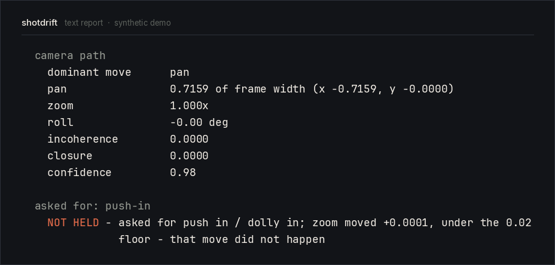

# shotdrift for ComfyUI

**You asked the model for a slow push in. Measure whether you got one — in the
graph that made it.**

Generative video is given a camera move and is under no obligation to deliver it.
The usual check is a person watching sixty clips and forming an impression, and by
then the graph has moved on. These nodes measure the camera path out of the pixels
— pan, scale and roll, frame by frame — and can fail the current prompt when a
take did not hold the requested move or could not be fully measured. Other queued
prompts continue. These are experimental 2D motion checks, not a 3D camera solve.



```
Shotdrift Measure (frames)
  images  ──────────────▶ images   (untouched, wire it straight through)
  expect: push-in         report   (the text below)
  fail_on: nothing        held     (BOOLEAN - use it to reroll)
                          json     (machine-readable)
```

```
  camera path
    dominant move      pan
    pan                0.7159 of frame width (x -0.7159, y -0.0000)
    zoom               1.000x
    roll               -0.00 deg
    incoherence        0.0000
    closure            0.0000
    confidence         0.98

  asked for: push-in
    NOT HELD - asked for push in / dolly in; zoom moved +0.0001, under the 0.02
               floor - that move did not happen
```

A perfectly good shot. Also not the shot that was ordered — it pans, and the
push-in never happened. Motion findings and the requested movement are reported
separately.

## Install

Clone it into `ComfyUI/custom_nodes` and install the requirements with the
Python that runs ComfyUI:

```console
cd ComfyUI/custom_nodes
git clone https://github.com/Syamjith-NK/shotdrift-comfyui
../../python_embeded/python -m pip install -r shotdrift-comfyui/requirements.txt
```

`python_embeded/python` is the portable Windows build. On a venv or any other
install, run that same `pip install -r` with the interpreter that launches
ComfyUI — not another Python on `PATH`. That is the one mistake worth calling
out, and the node says so by name if it loads without its measurement library.

It is not in the ComfyUI Registry or ComfyUI Manager yet. That install is coming;
searching Manager for **shotdrift** will not find this node.

It pulls in `numpy` and `pillow` only: no torch beyond the one ComfyUI already
has, no OpenCV, no model weights, no network. The *file* node additionally
needs both `ffmpeg` and `ffprobe` on PATH.

Version 0.1.1 requires **shotdrift >= 0.2.2** for coverage and unknown-result
handling. Before that core version is published, install the fixed source into
ComfyUI's interpreter first:

```console
path/to/comfy/python -m pip install /path/to/shotdrift
path/to/comfy/python -m pip install -r /path/to/shotdrift-comfyui/requirements.txt
```

Release the core package first, then this integration. CI's dependency install
also requires the published core release.

## The two nodes

**Shotdrift Measure (frames)** takes an `IMAGE` batch and passes it through
unchanged. This is the generator's actual output, before encoding.

**Shotdrift Measure (file)** takes a path. Not the same question: that file has
been through a codec, and it is the thing that ships. It is an output node, so it
can execute standalone. It deliberately reruns on every prompt to avoid stale
reports when a file is overwritten. Reports go to the console and output ports.

For saving and measuring in one graph, connect a STRING output from the save node
to `after`, or connect the save node's resulting path to `path`. A typed filename
alone does not order the save before measurement. If the save node offers no
usable output, run measurement in a separate prompt after saving completes.

[`docs/workflows/file-check.api.json`](docs/workflows/file-check.api.json) is a
minimal standalone API prompt. Replace its path, then submit it under the
`prompt` key to ComfyUI's `/prompt` API. It is API-format JSON, not a frontend
canvas export. For the frames node, wire its IMAGE output into the save node.

Both carry the same controls:

| input | what it does |
|---|---|
| `expect` | the move you asked for. Checked three ways: did it happen, was it the right way round, was it *held* |
| `fail_on` | `nothing` only reports; other modes fail this prompt on the selected condition or incomplete measurement |
| `max_side` | analysis resolution; units stay normalized, but precision and verdicts can change |
| `grid` | tiles per axis that get tracked and fitted |
| `segment` | detect cuts and measure each shot separately. Off measures the batch as one take, which is wrong for an edit |

### Gating a batch

`fail_on` defaults to `nothing`: report and return `held=False` for a failed or
unknown result. Every active gate also rejects blank/unmeasurable footage, short
unknown spans and a truncated frame budget. The exception stops this prompt;
other queued prompts are not cancelled. Increase `max_frames` for longer files.
`held` means every shot is clean, coverage is complete, and any expectation held.

### Declared moves

`static` `locked` `push-in` `dolly-in` `zoom-in` `pull-out` `dolly-out`
`zoom-out` `pan-left` `pan-right` `tilt-up` `tilt-down` `roll-cw` `roll-ccw`

The signs are **camera-relative**: a camera panning right makes the picture move
left.

## What it cannot do

Taken straight from [the measurement's own
calibration](https://github.com/Syamjith-NK/shotdrift/blob/main/calibration.md),
because what a measurement cannot do is as useful as what it can:

- **It cannot distinguish a physical dolly from a digital zoom.** `push-in`,
  `dolly-in` and `zoom-in` use the same scale channel. It does not verify exact
  speed, the word "slow", or continuous movement throughout every frame.
- **The historical calibration footage is not included.** The stricter coverage
  rules require a new full validation on those files; synthetic tests alone do
  not establish real-world accuracy.

- **It does not detect invented geometry.** The melting-background tell is the
  check this was supposed to have. It does not work: real footage reached a
  structural residual of **1.06** while a literal cross-dissolve between two
  different worlds read **0.358**. Real scenes contain people and moving light, so
  they change structure *more* than melting geometry does. A dissolve under a
  locked-off camera comes back **clean**, and that is pinned as a test.
- **Direction changes are not a fault signal.** Real operated footage showed 27
  direction changes on a slow zoom against 3 in a deliberately broken control.
- **Subject motion raises `incoherence`**, by construction. A person crossing a
  locked-off frame is reported `soft`, with advice saying so, rather than
  pretended away.
- **Nothing is calibrated against generated video.** The thresholds were set on
  real camera footage and synthetic controls, so they are validated for *not
  flagging reality* and for *naming known faults* — not against any particular
  generator's failure modes. That gap is the honest one, and it closes with
  measurements from people running this in real graphs.

## Tests

```console
pip install pytest torch
python -m pytest -q
```

They cover the node *contract* — ComfyUI does not call these classes, it inspects
them, so a node can be perfectly correct and still not appear — and the tensor
boundary, with real tensors rather than stubs, because a stub that answers
`.cpu()` would pass a test the real thing fails.

The default suite does not require ComfyUI. To check the real executor and cache
with an existing installation (and FFmpeg/FFprobe), use its Python:

```console
path/to/comfy/python tests/integration_comfy.py --comfy-root /path/to/ComfyUI
```

This uses synthetic files and the real validator/executor in a separate process;
it does not install nodes into the app or run a generation model. The test checks
standalone execution, same-path file replacement, rejection and recovery.
Frontend rendering, model generation and desktop queue controls remain outside
this test.

MIT. The measurement is [shotdrift](https://github.com/Syamjith-NK/shotdrift),
built by [Syamjith NK](https://syamjithnk.com) — cinematographer and AI creative
technologist, Abu Dhabi.
